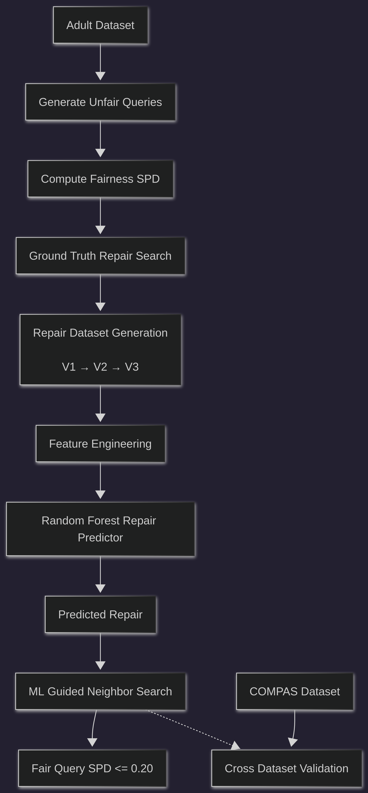
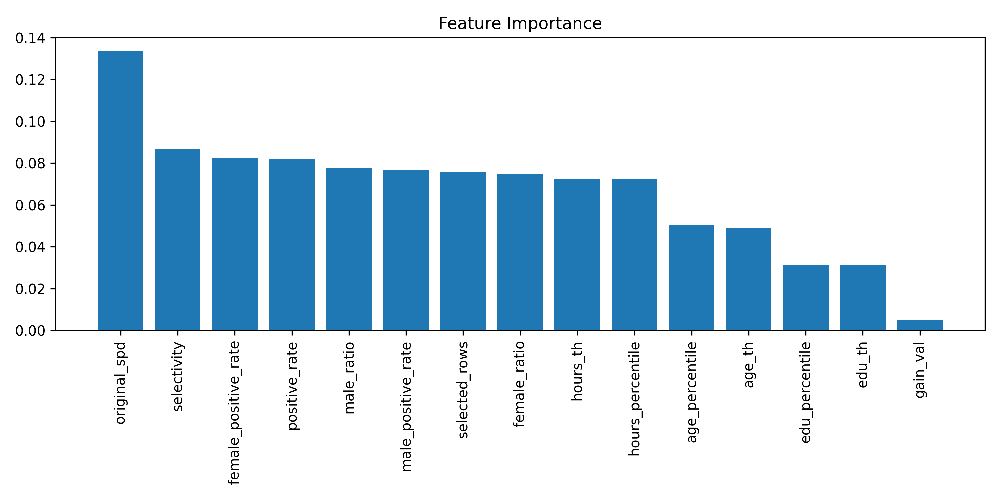

# FairQueryRepair-ML

Machine Learning Guided Fair Query Repair with Cross-Dataset Adaptation.

---

## Project Overview
## Framework

<h2>Framework</h2>

<p align="center">
  
</p>


Modern database queries may satisfy all SQL predicates while still violating real-world fairness requirements. This project investigates how unfair queries can be automatically repaired by modifying query predicates so that the resulting query satisfies fairness constraints.

The work builds upon a fairness-aware query repair framework and extends it with machine learning techniques for repair prediction, confidence estimation, and ML-guided search.

---

## Problem Statement

Given:

* A user query
* A fairness constraint (e.g., Statistical Parity Difference (SPD) ≤ 0.20)

Find:

* A minimally modified query (repair) that satisfies the fairness constraint while preserving query validity.

---

## Original Framework

The original framework:

1. Generates unfair queries
2. Measures fairness using Statistical Parity Difference (SPD)
3. Searches for valid repairs
4. Returns the top-k repaired queries

Pipeline:

Unfair Query → Fairness Evaluation → Repair Search → Fair Query

---

## Proposed Extensions

### 1. Machine Learning-Based Repair Prediction

A Random Forest model is trained on historical query-repair pairs to predict repair actions.

Three progressively richer datasets were created:

* **V1**: Query thresholds and repair targets
* **V2**: Added fairness statistics
* **V3**: Added repair-distance information

### 2. ML-Guided Search

Pure ML predictions are used as a starting point for local neighborhood exploration.

Pipeline:

ML Prediction → Neighbor Generation → Fairness Validation → Best Repair

### 3. Cross-Dataset Adaptation

The framework was adapted from the Adult Income dataset to the COMPAS recidivism dataset to evaluate cross-domain applicability.

---

## Experimental Results

### Repair Prediction

| Method           | Success Rate |
| ---------------- | ------------ |
| Pure ML Repair   | 28%          |
| ML-Guided Search | 87%          |

## Feature Importance



### Fairness Improvement

| Dataset | SPD Before | SPD After |
| ------- | ---------- | --------- |
| Adult   | 0.248      | 0.175     |
| COMPAS  | 0.191      | 0.113     |

---

## Datasets

### Adult Income Dataset

Used to generate:

* training_repairs_v1.csv
* training_repairs_v2.csv
* training_repairs_v3.csv

### COMPAS Dataset

Used for cross-dataset adaptation:

* compas_repairs_v2.csv

---

## Repository Structure

```text
datasets/
├── training_repairs_v1.csv
├── training_repairs_v2.csv
├── training_repairs_v3.csv
└── compas_repairs_v2.csv

figures/

notebooks/
├── final_experiments.ipynb
└── cross_dataset.ipynb

results/

paper/
```

---

## Reproducibility

Main experiments can be reproduced using:

* `notebooks/final_experiments.ipynb`
* `notebooks/cross_dataset.ipynb`

---

## Future Work

* Cross-domain transfer learning
* Additional fairness metrics
* Multi-objective query repair
* Adaptive repair search strategies
